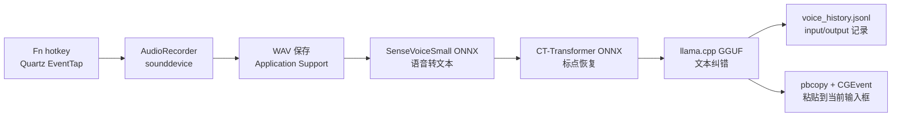

# MyVoiceTyping

> 面向 macOS 的本地优先语音输入工具：按下快捷键说话，松开后自动转写、轻量纠错，并把文本粘贴到当前输入位置。

MyVoiceTyping 不是聊天机器人，也不是云端听写服务。它的定位更接近一个常驻桌面的“语音输入加速器”：把本地 ASR、标点恢复、本地文本纠错和系统级粘贴串成一条尽量短的链路，让日常写文档、记需求、回消息时少打字、多说话。


## Highlights

- **macOS first**：当前版本只面向 Apple PC/macOS 维护和打包。
- **本地优先**：语音识别、标点恢复、文本纠错默认都走本地模型，减少音频和文本外发。
- **全局快捷键**：默认使用 `Fn` 按住说话，基于 Quartz EventTap 监听，应用隐藏后也可触发。
- **自动写入当前输入框**：转写完成后写入剪贴板，并通过 CGEvent 触发 `Cmd + V`。
- **轻量纠错润色**：使用本地 GGUF 文本纠错模型，对 ASR 结果做少量改写，尽量保留原意。
- **热词设置**：支持在设置页维护 FunASR 热词，用于常见技术词、项目词、人名等场景。
- **历史记录工作台**：记录最近输入、累计字数、节约时间；支持查看和手工修正最近一次输入。
- **首次启动下载模型**：安装包不内置大模型，首次启动按需下载到用户可写目录。
- **macOS 权限引导**：对输入监控、辅助功能、麦克风权限做提示和跳转。

## How It Works



核心路径：

1. `run.py` 启动应用，初始化日志和 `FlashInputApp`。
2. `src/main.py` 编排录音、静音、ASR、文本纠错、历史记录和粘贴。
3. `src/components/hotkey.py` 使用 macOS Quartz EventTap 注册全局快捷键。
4. `src/components/audio_recorder.py` 使用 `sounddevice` 录制 16k PCM 音频。
5. `src/core/stt_local_processor.py` 使用 vendored `funasr_onnx` + `onnxruntime` 做本地 ASR 和标点恢复。
6. `src/core/text_rewrite.py` 使用 `llama-cpp-python` 加载本地 GGUF 文本纠错模型。
7. `src/components/gui_tk.py` 提供 customtkinter 桌面 UI、历史记录、设置页和下载进度。

## Model Pipeline

默认使用 3 个本地模型：

| 阶段 | 模型 | 用途 | 默认下载目录 |
| --- | --- | --- | --- |
| ASR | `botaruibo/SenseVoiceSmall-onnx` | 语音转文本 | `~/Library/Application Support/MyVoiceTyping/data/models` |
| 标点 | `botaruibo/punc_ct-onnx` | 标点恢复 | 同上 |
| 纠错 | `botaruibo/chinese_text_correction_1.5b_gguf` | ASR 文本纠错/简单润色 | 同上 |

模型文件不会提交到 Git，也不会被打包进 `.app`。首次启动时应用会按顺序检查和下载模型：

1. 语音转录模型
2. 标点恢复模型
3. 中文纠错 GGUF 模型

开发环境默认数据目录在 `data/`；打包后的可写数据在：

```text
~/Library/Application Support/MyVoiceTyping/
├── audio/
├── config/
├── data/models/
├── logs/
└── transcripts/voice_history.jsonl
```

## Features

### 语音输入

- 默认按住 `Fn` 开始录音，松开后停止录音并转写。
- 录音期间可自动静音系统外放，结束后恢复原状态。
- 太短的音频会直接跳过，避免空录音生成无效文件。
- 录音浮窗使用 Cocoa 非激活面板，不抢占当前输入焦点。

### 本地文本处理

- SenseVoiceSmall ONNX 输出原始文本。
- CT-Transformer ONNX 恢复标点。
- llama.cpp 加载 `chinese_text_correction_1.5b` 4bit GGUF，对文本做轻量纠错。
- 默认参数偏保守：低温度、低随机性，减少“自由发挥”。

### 历史与统计

- 首页显示今日记录、今日字数、历史记录、累计字数和已节约时间。
- `voice_history.jsonl` 每行记录一条输入：

```json
{"dataId":"20260625_222254.wav","input":"ASR 标点恢复文本","output":"LLM 或手工修正后的文本"}
```

- “最近一次输入”文本框支持手工编辑，便于修正最终输出。

### 隐私与安全

- 默认不使用云端 ASR，也不上传音频。
- 本地配置、音频、历史记录、模型都写入用户目录或开发环境 `data/`，并被 `.gitignore` 忽略。
- 打包时会清空配置中的 `api_key`、`token` 等敏感字段。
- 如果启用云端 LLM 或第三方服务，请自行确认数据合规和密钥管理。

## Requirements

- macOS on Apple Silicon is the primary target.
- Python 3.11 is recommended.
- 系统权限：
  - 麦克风：录制语音
  - 输入监控：后台监听全局快捷键
  - 辅助功能：向其他应用发送 `Cmd + V`

主要运行依赖：

- GUI：`customtkinter`, `Pillow`, PyObjC (`AppKit`, `Quartz`, `Foundation`)
- 录音：`sounddevice`, `soundfile`, `numpy`
- 本地 ASR：`onnxruntime`, vendored `funasr_onnx`, `kaldi-native-fbank`, `sentencepiece`, `jieba`
- 模型下载：`modelscope`
- 本地纠错：`llama-cpp-python`
- 打包：`PyInstaller`, `create-dmg` 或 macOS `hdiutil`

## Quick Start

```bash
python -m venv venv
source venv/bin/activate
pip install -r requirements.txt
python run.py
```

首次启动会检查本地模型；如果缺失，会显示下载进度。下载完成后模型会保存在本机，不需要每次重复下载。

## Build

当前打包方案以 PyInstaller 为准。

```bash
source venv/bin/activate
scripts/build_app.sh
```

生成 `.app` 后可以打包 DMG：

```bash
bash build_dmg.sh
```

为了减少 macOS TCC 权限在重装后失效，可以创建本地自签名代码签名证书：

```bash
bash create_signing_cert.sh
CODESIGN_IDENTITY="MyVoiceTyping Self-Signed" bash build_dmg.sh
```

说明：

- `MyVoiceTyping.spec` 不打包 `data/models` 下的大模型。
- `build_dmg.sh` 会检查 `.app` 中是否包含默认配置和 prompt。
- 自签名证书主要用于稳定本机权限身份，不等价于 Apple Developer ID notarization。

## Project Structure

```text
.
├── assets/                    # App 图标和 UI 资源
├── data/config/               # 开发环境默认配置和 prompt，敏感配置不要提交
├── docs/                      # 项目文档和截图
├── scripts/build_app.sh       # PyInstaller 构建入口
├── src/
│   ├── components/            # GUI、录音、快捷键、录音浮层
│   ├── core/                  # STT、文本纠错、进度条
│   ├── util/                  # 日志、macOS 权限引导
│   └── vendor/funasr_onnx/    # 精简后的 funasr_onnx 运行实现
├── MyVoiceTyping.spec          # PyInstaller 配置
├── build_dmg.sh               # DMG 打包脚本
└── run.py                     # 应用入口
```

## Development Notes

- 代码默认按 macOS-only 维护，不再保留 Windows/Linux 兼容分支。
- 手工测试热键时注意系统权限，尤其是“输入监控”和“辅助功能”。
- 不要把以下内容提交到 Git：
  - `data/models/`, `data/audio/`, `data/transcripts/`
  - 本地私有配置，例如包含真实密钥的 `data/config/app_config.json`
  - `logs/`
  - `dist/`, `build/`, `.pyinstaller-cache/`
  - `*.gguf`, `*.onnx`, `*.safetensors`, `*.pt`, `*.pth`
  - `.env*`, `*.pem`, `*.p12`, `*.cer`, `*.key`
- 修改打包配置后建议执行：

```bash
venv/bin/python -m py_compile src/main.py src/components/gui_tk.py src/core/stt_local_processor.py src/core/text_rewrite.py
scripts/build_app.sh
```

## Contributing / 二次开发

欢迎围绕以下方向二开：

- 更稳定的全局快捷键策略，例如不同键盘/系统版本下的 Fn 掩码适配。
- 更轻的 ASR 推理链路，进一步降低打包体积。
- 更好的热词后处理策略，减少专有名词误识别。
- 更细粒度的历史记录管理，例如搜索、导出、批量清理。
- 更丰富的本地文本处理模型适配。

提交建议：

1. 保持 macOS-first，不引入未验证的跨平台分支。
2. 不提交模型文件、音频、日志、真实配置和任何 API Key。
3. 大依赖新增前先说明必要性和包体积影响。
4. UI 改动请附截图或说明测试过的窗口尺寸。
5. 打包链路改动请说明 `.app` 和 DMG 的验证方式。

## Credits

MyVoiceTyping 站在这些开源项目和生态之上：

- [FunASR](https://github.com/modelscope/FunASR) / SenseVoice
- [ONNX Runtime](https://onnxruntime.ai/)
- [ModelScope](https://modelscope.cn/)
- [llama.cpp](https://github.com/ggerganov/llama.cpp) and `llama-cpp-python`
- [customtkinter](https://github.com/TomSchimansky/CustomTkinter)
- PyObjC / macOS Cocoa, Quartz, ApplicationServices
- PyInstaller

## License

本项目源码建议采用 Apache License 2.0 开源。

模型文件不随源码仓库分发，首次运行时按需下载。SenseVoice、标点模型、中文纠错模型等模型权重遵循其上游模型仓库声明的 license；商业使用前请分别确认模型授权。
