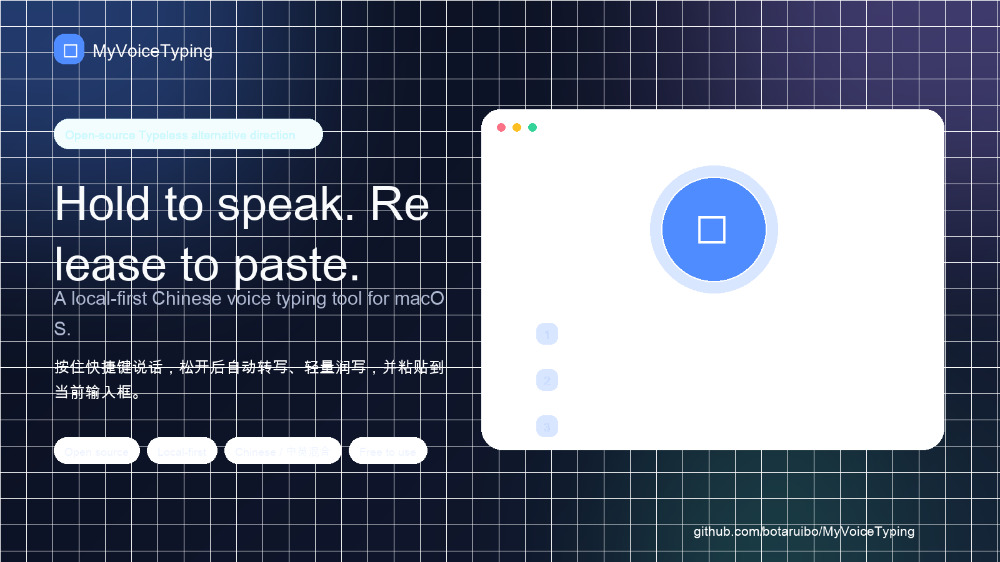
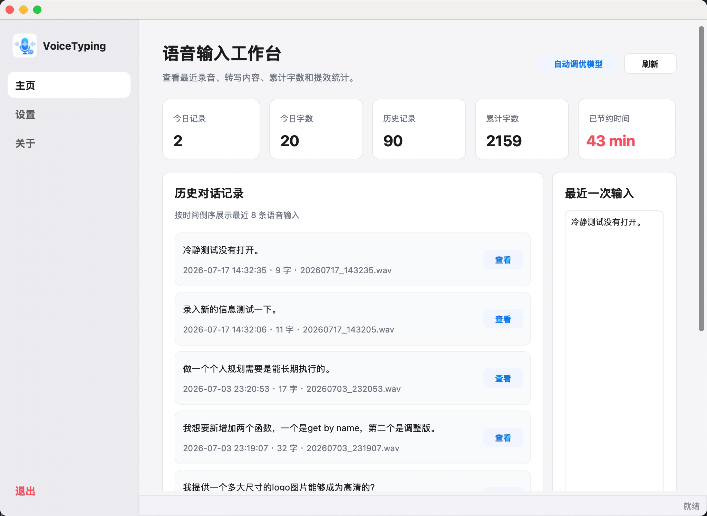

# MyVoiceTyping：开源、本地优先的 macOS 中文语音输入工具

面向 macOS 的开源、本地优先中文语音输入工具：按住快捷键，说话，松开后自动转写、恢复标点、轻量纠错并粘贴到当前输入位置。适合作为 Typeless / 闪电说之外的 0 费用、可审查、可改造选择。

## 你现在可以怎么试

| 你想做什么 | 入口 |
|---|---|
| 30 秒判断是否适合自己 | [Trial tasks / 30 秒试用任务](docs/TRIAL_TASKS.zh-CN.md) |
| 直接下载 macOS 安装包 | [Latest Release](https://github.com/botaruibo/MyVoiceTyping/releases) |
| 担心权限、隐私或模型下载 | [Privacy / Data Safety](docs/PRIVACY.md) · [FAQ](docs/FAQ.md) |
| 比较 Typeless / 闪电说 / 豆包 | [同类工具对比](docs/ALTERNATIVES.zh-CN.md) |
| 不想下载但愿意帮忙 | [告诉我你为什么不 Star / 不下载](https://github.com/botaruibo/MyVoiceTyping/issues/new/choose) |

首次试用建议只用虚构内容，不要直接输入公司机密、客户信息、Token、内部代码或私人聊天。当前 Demo/GIF 仍在制作中，如果你只是想先观察项目方向，Star 关注也很有帮助。

🌐 Website: https://botaruibo.github.io/MyVoiceTyping/  
⬇️ Download: https://github.com/botaruibo/MyVoiceTyping/releases  
📚 Docs index: https://github.com/botaruibo/MyVoiceTyping/blob/main/docs/INDEX.zh-CN.md  
🎬 Demo assets: https://github.com/botaruibo/MyVoiceTyping/blob/main/docs/DEMO_ASSETS.md  
📣 Community sharing: https://github.com/botaruibo/MyVoiceTyping/blob/main/docs/COMMUNITY_SHARING.md  
🗣️ Community proof: https://github.com/botaruibo/MyVoiceTyping/blob/main/docs/COMMUNITY_PROOF.md  
🧰 Press kit: https://github.com/botaruibo/MyVoiceTyping/blob/main/docs/PRESS_KIT.md  
🚀 Quickstart: https://github.com/botaruibo/MyVoiceTyping/blob/main/docs/QUICKSTART.zh-CN.md  
🧩 Use cases: https://github.com/botaruibo/MyVoiceTyping/blob/main/docs/USE_CASES.zh-CN.md  
🧪 Trial tasks: https://github.com/botaruibo/MyVoiceTyping/blob/main/docs/TRIAL_TASKS.zh-CN.md  
🧑‍🔬 Beta testing: https://github.com/botaruibo/MyVoiceTyping/blob/main/docs/BETA_TESTING.zh-CN.md  
🧭 Alternatives: https://github.com/botaruibo/MyVoiceTyping/blob/main/docs/ALTERNATIVES.zh-CN.md  
💬 Feedback: https://github.com/botaruibo/MyVoiceTyping/issues/new/choose  
🧭 Support: https://github.com/botaruibo/MyVoiceTyping/blob/main/SUPPORT.md  
🔒 Privacy: https://github.com/botaruibo/MyVoiceTyping/blob/main/docs/PRIVACY.md  
🧠 Self-evaluation: https://github.com/botaruibo/MyVoiceTyping/blob/main/docs/SELF_EVALUATION.md  
🛡️ Security: https://github.com/botaruibo/MyVoiceTyping/blob/main/SECURITY.md  
🪪 License: MIT — https://github.com/botaruibo/MyVoiceTyping/blob/main/LICENSE  
🧾 License / usage boundaries: https://github.com/botaruibo/MyVoiceTyping/blob/main/docs/LICENSE_DECISION.zh-CN.md  
🎥 Demo/GIF status: https://github.com/botaruibo/MyVoiceTyping/issues/8

  

适合：写文档、回消息、记录需求、整理想法、AI Coding 需求描述，以及重视本地隐私的中文输入场景。

## 先判断它是否适合你

MyVoiceTyping 当前更适合愿意试早期开源工具的 macOS 用户：

- 你在找 Typeless / 闪电说之外的开源、本地优先方向；
- 你经常输入中文或中英混合内容；
- 你想用语音写 AI Coding prompt、需求、Bug 复现、工作消息；
- 你希望语音输入结果先粘贴到输入框，review 后再发送；
- 你在意 App / Model / Dataset 是否公开、可审查、可复现；
- 你愿意先用虚构内容测试，不一上来输入公司机密或私人内容。

最快路径：

- 先看 30 秒试用任务：[Trial tasks](docs/TRIAL_TASKS.zh-CN.md)
- 直接下载：[Latest Release](https://github.com/botaruibo/MyVoiceTyping/releases)
- 担心隐私：[Privacy / Data Safety](docs/PRIVACY.md)
- 比较同类工具：[Alternatives / 同类工具对比](docs/ALTERNATIVES.zh-CN.md)

App 代码使用 MIT 许可证；模型和数据集有独立使用边界。Demo/GIF 仍在制作中。若你暂时不想下载，也欢迎直接反馈阻碍：没有 Demo、安装权限麻烦、模型下载不确定、隐私边界不够可信，或已有 Typeless / 闪电说 / 豆包够用。

## 30 秒判断是否值得 Star

如果你是从 Typeless、闪电说、OpenTypeless、OpenLess、SayIt、VoiceSnap 或其他语音输入工具对比里点进来的，可以先用这个最短路径判断是否适合：

1. 打开 [Trial tasks / 30 秒试用任务](docs/TRIAL_TASKS.zh-CN.md)，任选一条虚构任务；
2. 看它是否解决你的核心场景：中文 / 中英混合、AI Coding prompt、工作消息、Bug 复现或隐私敏感输入；
3. 如果方向对你有用，欢迎点一个 Star 关注后续版本；如果暂时不适合，也欢迎在 [Use case feedback](https://github.com/botaruibo/MyVoiceTyping/issues/new/choose) 里告诉我卡在哪里。

Star 对这个早期开源项目很重要：它会帮助更多 macOS 中文用户发现一个本地优先、0 费用、App / 模型 / 数据集公开的语音输入选择，也会帮助判断 [Roadmap](ROADMAP.md) 里 0→50、50→200、200→1000 stars 阶段哪些能力最值得继续投入。

如果你愿意帮这个早期项目挑毛病，可以看 [Beta 测试 / 3 分钟反馈](docs/BETA_TESTING.zh-CN.md)：重点反馈安装权限、模型下载、中文 / 中英混合、AI Coding prompt、隐私说明，以及你为什么愿意或不愿意 Star。

如果你暂时没时间完整安装，也可以先这样判断是否值得 Star / 关注：

- 你是否在找 Typeless / 闪电说之外的开源、本地优先方案；
- 你是否经常在 macOS 上输入中文 / 中英混合内容；
- 你是否会把语音输入用于 AI Coding prompt、需求、Bug 复现、工作消息或笔记；
- 你是否在意代码、模型、数据集都能公开审查；
- 你是否愿意给早期项目一点反馈，帮助补齐 Demo/GIF、更稳定的试用体验和中文 / 中英混合输入质量。

如果这些问题里有 2–3 个命中，Star 关注会很有帮助；如果你更想先看成熟商业体验，可以继续比较 Typeless、闪电说、Typeoff 或 Wispr Flow。

## 为什么做这个项目

MyVoiceTyping 可以理解为 Typeless 的开源平替方向：它同样关注“说话直接变成可用文字”的输入体验，但更强调 0 费用、本地数据安全、可审查和可复现。

核心差异：

- 本地优先：默认尽量让音频和文本留在本机，减少敏感内容外传。
- 0 费用：开源项目，可直接试用、学习和二次开发。
- 中文优先：重点优化 macOS 中文语音输入、标点恢复和轻量纠错/润写。
- 可复现：应用、输入文本润写模型和调优数据集都公开。
- 自进化方向：用户确认后的改写数据可作为本地偏好样本，先用于评估、热词和规则优化，后续在用户明确授权下探索本地轻量调优，让本地 LLM 逐步贴合个人表达习惯。

核心链路：

`语音 → SenseVoiceSmall ONNX → 标点恢复 → MyVoiceTyping-1.5b-q4 GGUF 纠错/轻量润写 → 粘贴`

默认音频和文本不上传云端。当前主要目标平台为 macOS。

隐私与数据安全边界见 [Privacy / Data Safety](docs/PRIVACY.md)。后续计划见 [Roadmap](ROADMAP.md)。如果你正在比较 Typeless、OpenTypeless、OpenLess、SayIt、闪电说、Typeoff、Wispr Flow、Handy、MacParakeet 等语音输入工具，可以看 [同类工具对比 / 选型建议](docs/ALTERNATIVES.zh-CN.md) 或 [Alternatives / Comparison](docs/ALTERNATIVES.md)。

## Self-evaluation / 自进化

语音输入最难的地方，不只是识别准确率，而是“越来越像你自己会写出来的话”。MyVoiceTyping 后续会围绕 self-evaluation / 自进化继续打磨：

1. 语音输入先生成初稿；
2. 用户根据自己的真实表达习惯修改、确认；
3. 这些确认后的改写结果可以沉淀为本地偏好数据；
4. 先用于本地评估、热词和规则优化；后续在用户明确授权下探索本地 LLM 轻量调优；
5. 让模型逐步适应个人词汇、语气、常用表达和工作场景。

这个方向会优先遵守本地优先原则：用于调优的数据应尽量保留在用户自己的设备上，由用户自行控制是否保留、删除或参与训练。更具体的样例格式、使用边界和当前完成度见 [Self-evaluation / 本地自进化说明](docs/SELF_EVALUATION.md)。

## 3 分钟开始

1. 先看 [快速上手 / macOS 试用指南](docs/QUICKSTART.zh-CN.md)，再下载最新 [Release](https://github.com/botaruibo/MyVoiceTyping/releases)。
2. 首次启动时授予麦克风、输入监控和辅助功能权限。
3. 按住快捷键说一句中文，松开后查看结果。
4. 首次启动会按需下载本地模型；模型文件不会进入 Git 仓库或安装包。

想先看输入效果，可以查看 [Demo / 使用效果示例](docs/DEMO.md)、[Use cases / 使用场景](docs/USE_CASES.zh-CN.md) 和 [Trial tasks / 30 秒试用任务](docs/TRIAL_TASKS.zh-CN.md)；如果想录制、转发、投稿或在相关社区讨论里透明自荐，可以参考 [Demo assets / 演示传播素材](docs/DEMO_ASSETS.md)、[Community sharing / 社区讨论回复素材](docs/COMMUNITY_SHARING.md)、[Community proof / 社区讨论与外部文章](docs/COMMUNITY_PROOF.md)、[Press kit / 投稿包](docs/PRESS_KIT.md) 和 [Demo video script / 录屏脚本](docs/DEMO_VIDEO.md)。当前 Demo/GIF 制作进展见 [Issue #8](https://github.com/botaruibo/MyVoiceTyping/issues/8)。遇到权限、模型下载、转写质量或粘贴问题，请先查看 [FAQ / Troubleshooting](docs/FAQ.md)。

## 三个开源资产

- 应用：[MyVoiceTyping](https://github.com/botaruibo/MyVoiceTyping)
- 文本润写模型：[MyVoiceTyping-1.5b-q4](https://modelscope.cn/models/botaruibo/MyVoiceTyping-1.5b-q4)
- ASR 后纠错数据集：[GitHub Dataset](https://github.com/botaruibo/MyVoiceTyping-Dataset) · [ModelScope Dataset](https://modelscope.cn/datasets/botaruibo/MyVoiceTyping-Dataset)

如果你有可公开、已脱敏的中文 ASR 后处理失败样例（错词、技术词误改、中英混合丢词、标点断句不自然、润写过度等），可以提交到 Dataset 的 [样例征集 Issue](https://github.com/botaruibo/MyVoiceTyping-Dataset/issues/1)，帮助后续改进本地润写模型和 self-evaluation 流程。

License / 使用边界：App 代码使用 [MIT License](LICENSE)。模型和数据集是独立资产：模型页当前标注 Apache-2.0，同时请遵守上游 Qwen 模型许可；数据集由多个公开来源整理而来，使用、再分发、商业训练或公开发布模型前，请查看 Dataset 的 [DATA_LICENSE](https://github.com/botaruibo/MyVoiceTyping-Dataset/blob/main/DATA_LICENSE.md) 和 [SOURCES](https://github.com/botaruibo/MyVoiceTyping-Dataset/blob/main/docs/SOURCES.md)，并确认各原始数据源的许可证、引用要求和使用边界。

模型在应用中的作用、Ollama / llama.cpp 使用方式和数据边界见 [Model usage / 模型使用说明](docs/MODEL.md)。

如果它解决了你的中文输入问题，欢迎先实际体验，再通过 Star 关注后续版本；安装、权限、转写、润写或 AI Coding prompt 问题可以通过 [Issue templates](https://github.com/botaruibo/MyVoiceTyping/issues/new/choose) 提交结构化反馈。不确定该去哪里反馈时，请先看 [Support / 反馈与支持](SUPPORT.md)。想参与反馈、文档或代码改进，请查看 [Contributing](CONTRIBUTING.md)；如果发现日志、调试信息、模型下载或 self-evaluation 数据相关的安全 / 隐私问题，请先查看 [Security Policy](SECURITY.md)。

## Downloads / Releases

- [release-0.02](https://github.com/botaruibo/MyVoiceTyping/releases/tag/release-0.02) 是当前推荐下载版本。下载页已经补充 30 秒试用任务、Typeless / 闪电说 / Typeoff 选型入口、Press kit 和 Star 决策说明。
- 如果你只是想判断是否适合自己，建议先看 [Trial tasks](docs/TRIAL_TASKS.zh-CN.md)，用虚构内容测试 AI Coding prompt、工作消息、中英混合技术词和隐私敏感输入，不要一上来输入真实公司内容。
- 如果你准备推荐、投稿或转发项目，可以直接使用 [Press kit / 投稿包](docs/PRESS_KIT.md)。

- [release-0.01](https://github.com/botaruibo/MyVoiceTyping/releases/tag/release-0.01)

## Changelog

### release-0.02

- 优化首页和设置页 UI，新增更清晰的统计卡片、最近输入编辑区和关于页。
- 默认使用全本地链路：SenseVoice ONNX ASR、CT-Transformer 标点恢复、本地 GGUF 文本改写。
- 文本改写模型切换为 [botaruibo/MyVoiceTyping-1.5b-q4](https://modelscope.cn/models/botaruibo/MyVoiceTyping-1.5b-q4)。
