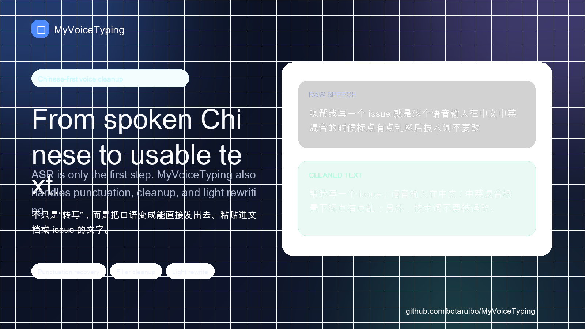
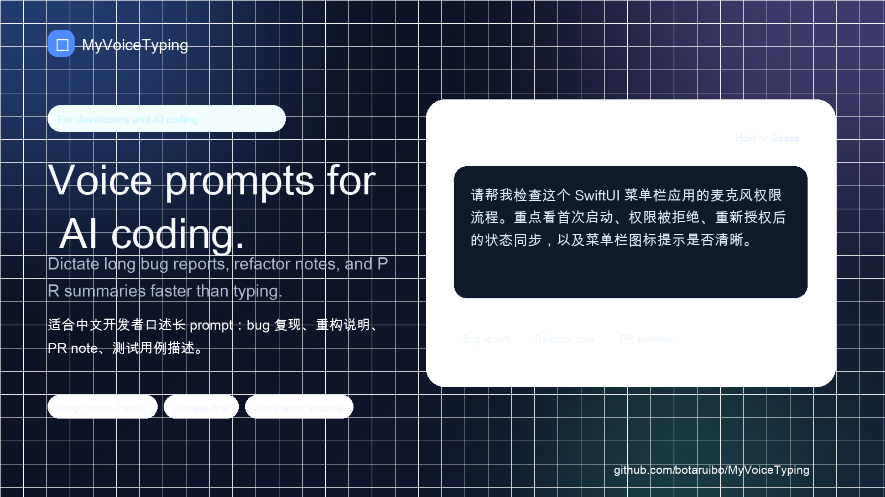
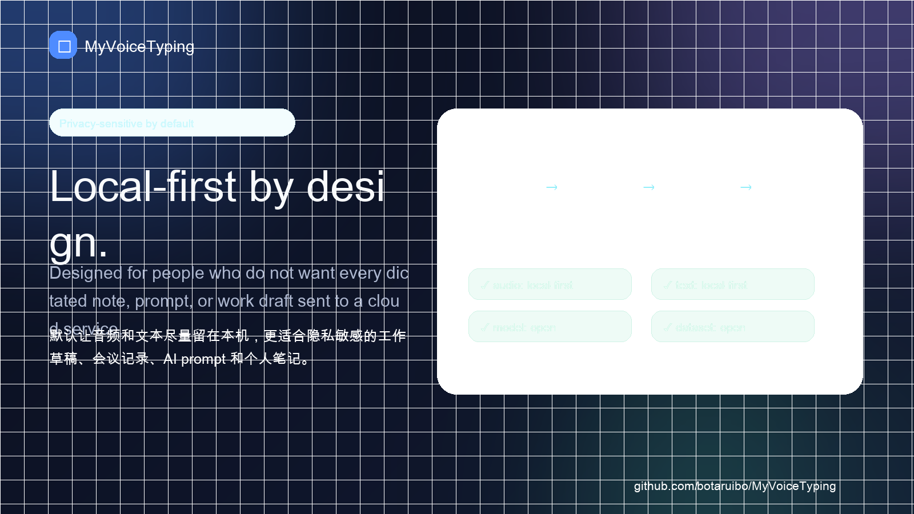
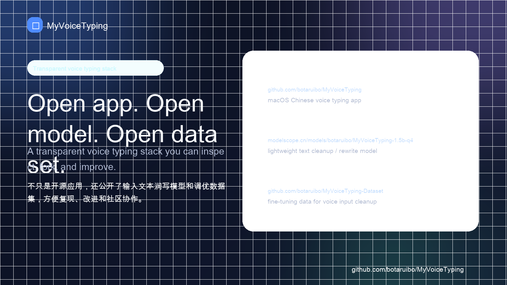

# Demo assets / 演示传播素材

这页用于给社区帖子、周刊投稿、产品目录、作者私信和发布平台快速引用。它不是功能承诺清单，而是帮助新用户在 30 秒内理解 MyVoiceTyping：一个面向 macOS 中文 / 中英混合输入的本地优先开源语音输入项目。

> Copy safety: 不展示真实公司代码、客户名、私聊、邮箱、Token、内部文档或未脱敏日志。对外传播时建议使用下面的示例文本或自己重新造一段无敏感信息的口述内容。

## One-line pitch

中文：

```text
MyVoiceTyping 是一个面向 macOS 的本地优先中文语音输入开源项目：按住快捷键说话，松开后完成本地识别、标点恢复、轻量纠错/润写，并粘贴到当前输入框。
```

English:

```text
MyVoiceTyping is a local-first Chinese voice typing tool for macOS: hold a hotkey, speak, release, then get cleaned-up text pasted into the current input field.
```

## 5 张截图 / launch cards

这些截图可以按顺序用于 README、社交媒体长图、Product Hunt gallery、Appinn 投稿补充或周刊编辑预览。

1. Core interaction  
   

2. Spoken Chinese cleanup  
   

3. AI Coding prompt workflow  
   

4. Local-first privacy  
   

5. Open app / model / dataset  
   

## 60 秒 Demo storyboard

完整脚本见：[60 秒 Demo 录制脚本](./DEMO_VIDEO.md)。

### 0–5 秒：痛点

```text
AI Coding 的瓶颈，有时不是模型，而是把需求说清楚。
```

画面：打开 Codex / Claude Code / Cursor / OpenCode / 浏览器 AI Chat 的空白输入框。

### 5–10 秒：项目定位

```text
MyVoiceTyping：本地优先的 macOS 中文语音输入。
```

画面：切到 landing 首屏或截图 1。

### 10–30 秒：核心演示

口述：

```text
帮我检查一下登录页面，用户点击发送验证码以后按钮应该进入倒计时，如果接口报错需要恢复按钮并显示错误信息。
```

目标输出：

```text
帮我检查一下登录页面：用户点击“发送验证码”以后，按钮应该进入倒计时；如果接口报错，需要恢复按钮并显示错误信息。
```

### 30–45 秒：差异点

```text
本地优先：尽量让音频和文本留在本机
0 费用：开源项目，可直接试用
可审查：应用、模型、数据集都公开
```

### 45–55 秒：Self-evaluation / 自进化

```text
用户确认后的改写结果，可以沉淀为本地偏好数据，后续用于调优本地 LLM，让模型越来越贴合自己的表达习惯。
```

### 55–60 秒：CTA

```text
Landing: https://botaruibo.github.io/MyVoiceTyping/landing/
GitHub: https://github.com/botaruibo/MyVoiceTyping
```

## 可复制发布文案

### 中文短版

```text
我在做一个本地优先的 macOS 中文语音输入开源项目：MyVoiceTyping。

它可以理解成 Typeless / 闪电说这类工具的开源平替方向：按住快捷键说话，松开后本地识别、标点恢复、轻量纠错/润写，再粘贴到当前输入框。

更适合在意数据安全、0 费用、中文/中英混合输入、AI Coding prompt，以及希望代码、模型和数据集都可审查的人。

项目：https://github.com/botaruibo/MyVoiceTyping
Landing：https://botaruibo.github.io/MyVoiceTyping/landing/
```

### AI Coding 场景

```text
AI Coding 里语音输入其实挺刚需：写 bug 复现、重构需求、PR note、长 prompt 的时候，打字经常跟不上思路。

MyVoiceTyping 的思路不是直接 auto-send，而是先把语音变成可编辑文本，再由用户确认后粘贴 / 发送。这样 ASR 识别错技术词时，还有机会改，不会直接变成错误 agent action。

它是本地优先的 macOS 中文语音输入开源项目，应用、润写模型和数据集都公开。

https://github.com/botaruibo/MyVoiceTyping
```

### 数据安全场景

```text
语音输入里经常会出现公司需求、代码 prompt、会议纪要、私人消息，所以我更倾向本地优先路线。

MyVoiceTyping 不是宣传“绝对 100% 隐私”，但它的设计方向是尽量让音频和文本留在本机，并把应用、模型、数据集公开出来，方便用户审查和二次开发。

如果你在比较 Typeless / 闪电说 / Typeoff，也可以看这个中文对比页：
https://github.com/botaruibo/MyVoiceTyping/blob/main/docs/ALTERNATIVES.zh-CN.md
```

## 推荐链接顺序

对普通用户：

1. Landing: <https://botaruibo.github.io/MyVoiceTyping/landing/>
2. Releases: <https://github.com/botaruibo/MyVoiceTyping/releases>
3. FAQ: <./FAQ.md>

对开发者 / 开源社区：

1. GitHub repo: <https://github.com/botaruibo/MyVoiceTyping>
2. Model: <https://modelscope.cn/models/botaruibo/MyVoiceTyping-1.5b-q4>
3. Dataset: <https://github.com/botaruibo/MyVoiceTyping-Dataset>
4. Feedback issue: <https://github.com/botaruibo/MyVoiceTyping/issues/3>
5. AI Coding feedback: <https://github.com/botaruibo/MyVoiceTyping/issues/5>

## 不建议这样说

- 不说“完全替代 Typeless / 闪电说 / Typeoff”；
- 不说“100% 隐私 / 绝对离线 / 绝对不上云”；
- 不说“识别率吊打某某产品”；
- 不暗示已经有大量用户或企业采用；
- 不在无关评论区只贴链接；
- 不展示或上传真实敏感语音 / 文本样例。

## Maintainer checklist

发布前快速检查：

- [ ] 截图或视频里没有真实敏感内容；
- [ ] 标题里使用“开源平替方向”而不是“完全替代”；
- [ ] 正文明确当前项目仍处于早期；
- [ ] 如果提到隐私，用“本地优先”而不是“绝对隐私”；
- [ ] 如果提到 self-evaluation，说明数据应本地保存、用户可控；
- [ ] 最后附上 GitHub repo 或 landing 链接，并邀请真实试用反馈。
